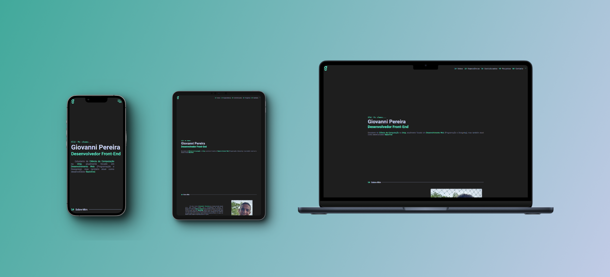

# Meu Portfólio

Bem-vindo ao meu portfólio! Este é um espaço onde apresento meu trabalho como desenvolvedor web e mostro minha paixão por criar interfaces digitais funcionais.  
Minha landing page foi projetada de forma simples e responsiva, garantindo uma experiência consistente em diferentes dispositivos.  

**Acesse o site aqui:** [https://giovannitavares.com](https://giovannitavares.com)

  

## Características Principais
**Design Vibrante e Limpo:** Inspirado na psicologia das cores, utilizei cores vibrantes para transmitir energia e positividade, mantendo a simplicidade para uma navegação agradável.  

**Projetos em Destaque:** Inclui meus projetos mais notáveis, demonstrando habilidades em HTML5, CSS3 e JavaScript. Cada um mostra meu comprometimento com qualidade e inovação.  

**Exploração Aberta:** Além dos projetos em destaque, há uma lista completa de todos os projetos no GitHub, com links diretos para os repositórios.  

## Objetivo
O objetivo deste portfólio é demonstrar meu conjunto diversificado de habilidades em desenvolvimento e design, além da minha paixão por criar interfaces impactantes.  
Estou buscando oportunidades de trabalho onde eu possa aplicar minhas habilidades em projetos inovadores.  

## Como Explorar
Visite meu portfólio para conhecer meus projetos, saber mais sobre mim e se conectar pelas redes sociais.  
Se tiver interesse em colaborar ou conversar sobre projetos, entre em contato!  
